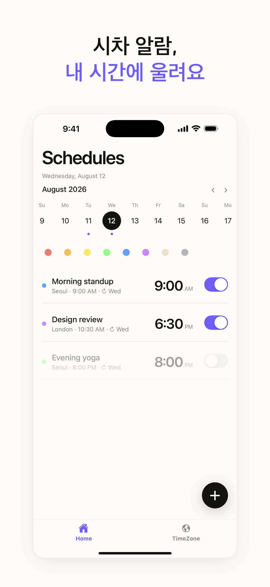
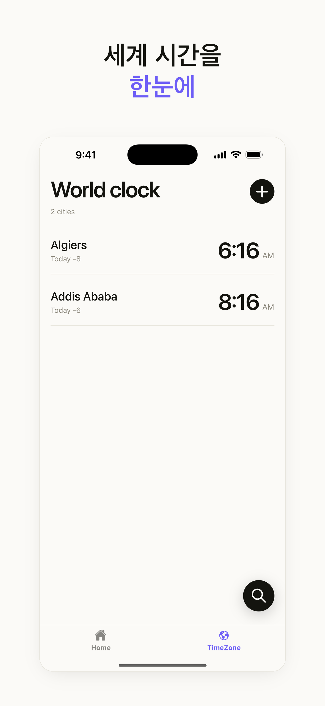
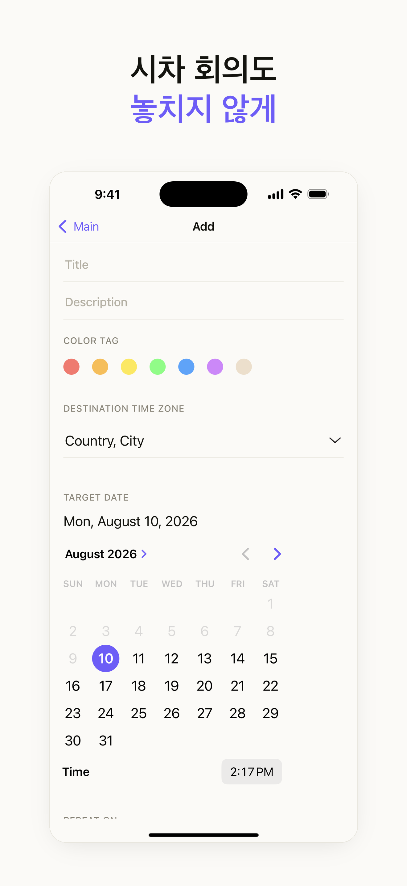
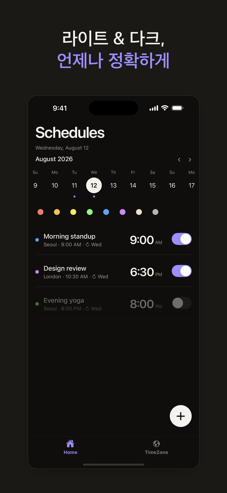
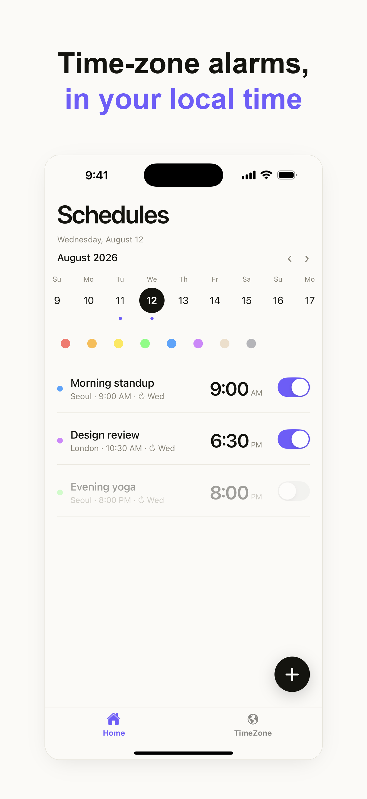
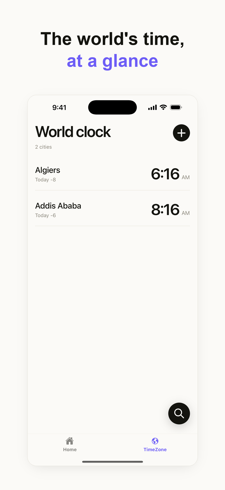
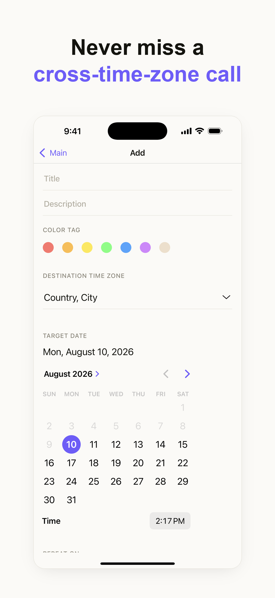
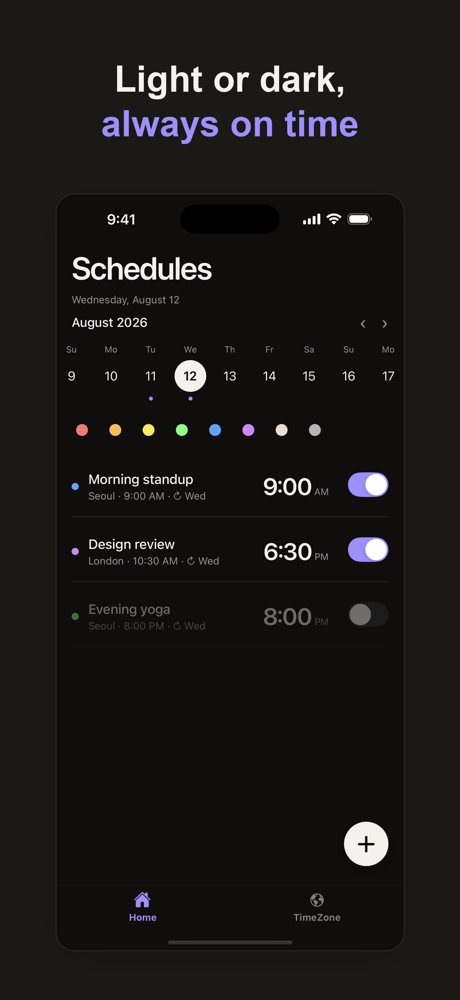
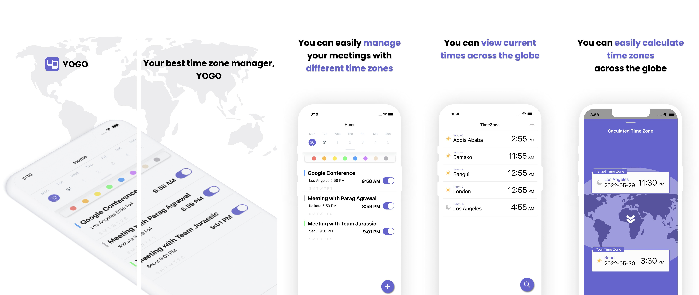

# YOGO 배포 자료 (Store Assets)

리뉴얼 후 앱스토어/플레이스토어 제출용 자료입니다.

- 📄 **[submission.md](submission.md)** — 메타데이터·개인정보·심사 노트·제출 체크리스트
- 🎞️ **[preview-ko/](preview-ko/)** · **[preview-en/](preview-en/)** — 스토어 소개 미리보기(마케팅 헤드라인 포함, 1320×2868)
- 🖼️ **[screenshots-6.9/](screenshots-6.9/)** — 순수 스크린샷 6.9" (App Store 필수)
- 🖼️ **[screenshots/](screenshots/)** — 순수 스크린샷 6.3"
- 🗄️ **[original-2022/](original-2022/)** — 2022년 최초 출시 때 만든 원본 마케팅 이미지(외부 링크로만 남아 있던 것 보존)

## 스토어 소개 미리보기 — 한국어

| | | | |
| --- | --- | --- | --- |
|  |  |  |  |
| 시차 알람 | 세계 시간 | 시차 회의 | 라이트&다크 |

## Store previews — English

| | | | |
| --- | --- | --- | --- |
|  |  |  |  |
| Alarms | World clock | Meetings | Light & dark |

## 순수 스크린샷 (프레임 없는 원본, 6.9")

| 홈 (일정) | 월드클락 | 일정 생성 | 홈 (다크) |
| --- | --- | --- | --- |
|  |  |  |  |

## 원본 (2022 최초 출시)

최초 출시 때 만든 마케팅 이미지 — 옛 UI 기준. 저장소엔 파일이 없고 README 외부 링크로만
남아 있던 것을 보존했습니다.

